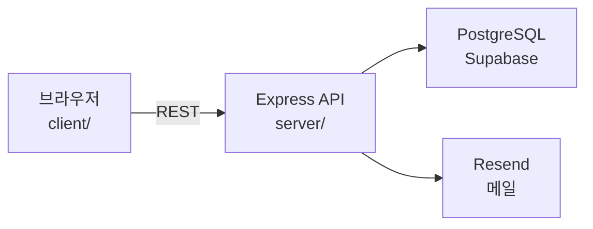

<div align="center">

# Vehicle Number Rental

**영업용 차량 번호(넘버) 중개 플랫폼**

국토부가 허용하는 범위 안에서, 기사와 회사가 영업용 번호를 찾고 거래할 수 있게 합니다.

<br />

## 📚 Tech Stack 📚

### ✨ Frontend ✨


### ⚒️ Backend ⚒️


### 🚀 Deploy & Services 🚀


<br />

[기능](#주요-기능) · [구성](#프로젝트-구성) · [실행](#로컬-실행) · [API](#주요-api)

</div>

---

## 주요 기능

| 구분 | 기사 | 회사 |
| :--- | :--- | :--- |
| **가입** | 이메일 · 카카오 · 구글 | 사업자등록번호 인증 |
| **둘러보기** | 로그인 없이 차량 목록/상세 | 번호 등록 · 수정 · 삭제 |
| **연락처** | 로그인 후 확인 | 결제 후 기사에게 노출 |
| **계정** | 비밀번호 재설정 | 여러 회사 전환 지원 |

> 차량 목록과 상세는 **비로그인**으로도 볼 수 있습니다.  
> 회사 연락처(`phone` / `contactPhone`)는 **로그인한 사용자에게만** 내려갑니다.

프론트 상세 화면 흐름: **자세히 보기 → 로그인 필요 모달 → 로그인 이동**

---

## 프로젝트 구성

```text
Vehicle-Number-Rental
├── client/    React (CRA) + TypeScript + Tailwind + Zustand
└── server/    Express + Prisma + PostgreSQL
```

| 구분 | 경로 | 스택 |
| :--- | :--- | :--- |
| Frontend | `client/` |     |
| Backend | `server/` |    |
| 배포 | — | Frontend: Vercel · API: [Render](https://vehicle-number-rental.onrender.com) · DB: Supabase |



---

## 로컬 실행

### 1. 백엔드

```bash
cd server
npm install
cp .env.example .env
npm run prisma:generate
npm run dev
```

| | |
| :--- | :--- |
| 기본 포트 | `server/.env`의 `PORT` (예: `3001`) |
| 헬스체크 | `GET /health` — 서버가 켜져 있으면 항상 `200` (DB는 body의 `db` 필드) |
| 레디니스 | `GET /ready` — DB까지 되면 `200`, 안 되면 `503` |

cron keep-alive는 차량 목록 대신 이 주소를 쓰면 됩니다.

```text
https://vehicle-number-rental.onrender.com/health
```

### 2. 프론트엔드

```bash
cd client
npm install
npm start
```

| | |
| :--- | :--- |
| 접속 | [http://localhost:3000](http://localhost:3000) |
| API 주소 | `client/.env`의 `REACT_APP_API_URL` |

---

## 이메일 (Resend)

서버 환경변수에 아래를 넣습니다. Render 같은 배포 환경에는 **로컬 `.env`가 적용되지 않으니** 대시보드에도 똑같이 넣어야 합니다.

| 변수 | 용도 |
| :--- | :--- |
| `RESEND_API_KEY` | Resend API 키 |
| `EMAIL_FROM` | 발신 주소 (로컬은 `onboarding@resend.dev` 가능) |
| `FRONTEND_URL` | 비밀번호 재설정 링크 · CORS |
| `APP_NAME` | 메일 제목/본문에 쓰는 앱 이름 |

---

## 주요 API

공개 엔드포인트는 인증 없이 호출할 수 있습니다. 🔒 표시는 로그인 필요.

### Health

| Method | Path | 설명 |
| :---: | :--- | :--- |
|  | `/health` | 서버 생존 확인 (cron용, 항상 200) |
|  | `/ready` | DB 준비 여부 (실패 시 503) |

### Auth

| Method | Path | 설명 |
| :---: | :--- | :--- |
|  | `/api/auth/register/user` | 기사 회원가입 |
|  | `/api/auth/register/company` | 회사 회원가입 |
|  | `/api/auth/login` | 로그인 |
|  | `/api/auth/password/reset-request` | 비밀번호 재설정 요청 |
|  | `/api/auth/password/reset` | 비밀번호 재설정 |
|  | `/api/auth/oauth/kakao/url` | 카카오 로그인 URL |
|  | `/api/auth/oauth/google/url` | 구글 로그인 URL |

### Vehicles

| Method | Path | 설명 |
| :---: | :--- | :--- |
|  | `/api/vehicles` | 목록 (비로그인 가능) |
|  | `/api/vehicles/:id` | 상세 (비로그인 가능, 연락처는 로그인 시) |
|  | `/api/vehicles/my` | 내 차량 🔒 회사 |
|  | `/api/vehicles` | 등록 🔒 |
|  | `/api/vehicles/:id` | 수정 🔒 |
|  | `/api/vehicles/:id` | 삭제 🔒 |

### Companies · Payments

| Method | Path | 설명 |
| :---: | :--- | :--- |
|  | `/api/companies/profile` | 회사 프로필 🔒 |
|  | `/api/companies/contact-phone` | 연락받을 번호 🔒 |
|  | `/api/payments` | 결제 생성 🔒 |
|  | `/api/payments/contact/:vehicleId` | 결제 후 연락처 🔒 |
